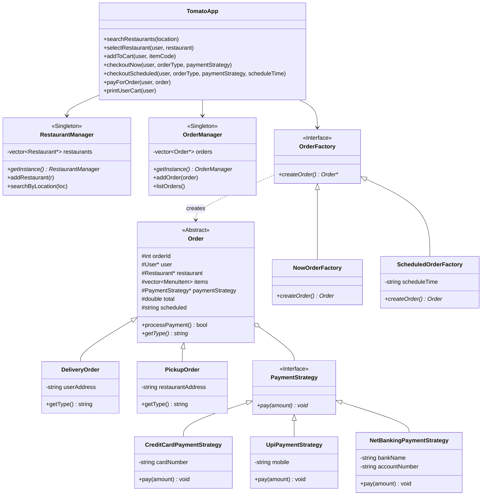

# Tomato - Food Delivery Application

A clean Low-Level Design (LLD) implementation of an online food delivery system.

---

## Architecture & Class Diagram



---

## 📁 Directory Structure

```
delivery/
├── arch.png                           # Architecture reference diagram
├── README.md                          # Project documentation
├── main.cpp                           # Composition root & test scenarios
├── index.cpp                          # Delegating entry point
├── TomatoApp.h                        # Facade orchestrator
├── models/
│   ├── MenuItem.h                     # Menu item (code, name, price)
│   ├── Restaurant.h                   # Restaurant entity with menu
│   ├── User.h                         # User profile with address & cart
│   ├── Cart.h                         # Cart managing items & subtotal
│   ├── Order.h                        # Abstract order base class
│   ├── DeliveryOrder.h                # Order variant for delivery
│   └── PickupOrder.h                  # Order variant for pickup
├── managers/
│   ├── RestaurantManager.h            # Singleton: restaurant registry & search
│   └── OrderManager.h                 # Singleton: order history & logging
├── strategies/
│   ├── PaymentStrategy.h              # Payment interface
│   ├── CreditCardPaymentStrategy.h    # Credit Card payment
│   ├── UpiPaymentStrategy.h           # UPI payment
│   └── NetBankingPaymentStrategy.h    # NetBanking payment
├── factories/
│   ├── OrderFactory.h                 # Abstract order factory interface
│   ├── NowOrderFactory.h              # Factory for immediate orders
│   └── ScheduledOrderFactory.h        # Factory for scheduled orders
├── services/
│   └── NotificationService.h          # Order confirmation & receipt
└── utils/
    └── TimeUtils.h                    # Timestamp formatting utility
```

---

## Build & Run

```bash
# Compile
g++ -std=c++17 -Wall -Wextra main.cpp -o tomato.exe

# Run
.\tomato.exe
```

---

## 💻 Quick Usage

```cpp
#include "TomatoApp.h"

int main() {
    Tomato* tomato = new Tomato();
    User* user = new User(101, "Aditya", "42 Connaught Place, New Delhi");

    // Search and select restaurant
    auto restaurants = tomato->searchRestaurants("Delhi");
    tomato->selectRestaurant(user, restaurants[0]);

    // Add items to cart
    tomato->addToCart(user, "P1");
    tomato->addToCart(user, "P2");

    // Checkout immediate delivery via UPI
    Order* order = tomato->checkoutNow(user, "Delivery", new UpiPaymentStrategy("9876543210@upi"));

    // Pay and notify
    tomato->payForOrder(user, order);

    delete user;
    delete tomato;
    return 0;
}
```
