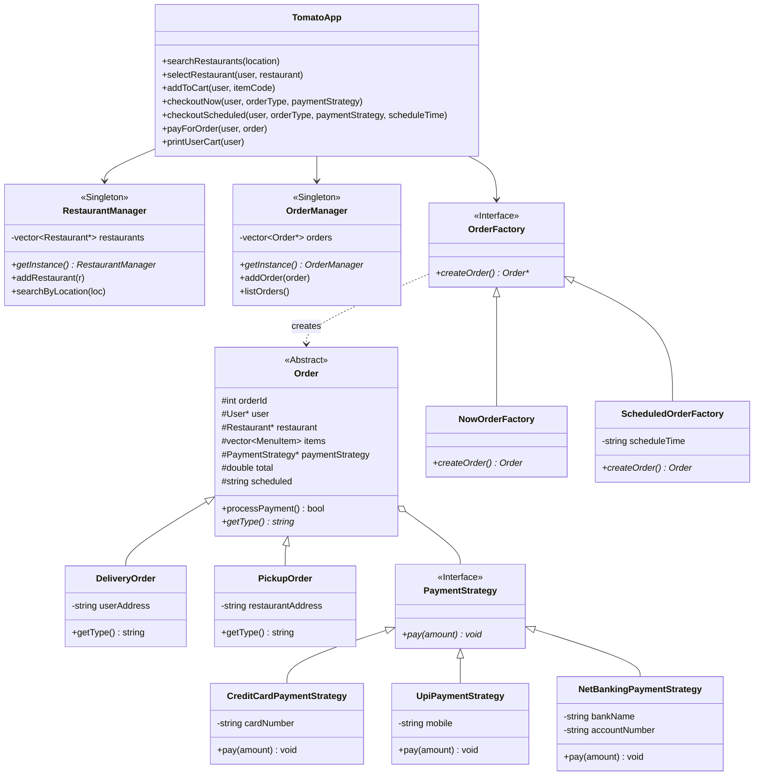

# 🍅 Tomato - Online Food Delivery System (Low-Level Design in Modern C++)

A production-grade, object-oriented Low-Level Design (LLD) implementation of a food ordering and delivery platform (similar to Zomato / Swiggy) in modern C++ (C++17). Designed following the architecture diagram (`arch.png`) and built with SOLID principles, clean design patterns, and leak-free memory management.

---

## 📐 Architecture & Class Diagram

The system employs several classic Gang of Four (GoF) design patterns to achieve loose coupling, extensibility, and maintainability:



---

## 🎨 Key Design Patterns

1. **Facade Pattern (`TomatoApp` / `Tomato`)**
   - Encapsulates the complexity of multiple subsystems (catalog search, cart operations, factory selection, payment processing, and notifications) behind a unified, easy-to-use client interface.

2. **Strategy Pattern (`PaymentStrategy`)**
   - Decouples order checkout from payment methods. Supports:
     - `UpiPaymentStrategy` (Mobile/UPI ID)
     - `CreditCardPaymentStrategy` (Card details)
     - `NetBankingPaymentStrategy` (Bank & account number, as specified in `arch.png`)

3. **Abstract Factory Pattern (`OrderFactory`)**
   - Enables polymorphic order creation without coupling client code to concrete order classes:
     - `NowOrderFactory`: Creates instant delivery or pickup orders stamped with current timestamp.
     - `ScheduledOrderFactory`: Creates future scheduled delivery or pickup orders.

4. **Singleton Pattern (`RestaurantManager`, `OrderManager`)**
   - Thread-safe Meyers' Singleton implementation guaranteeing single centralized registries for restaurants and order auditing.

5. **Template / Polymorphism (`Order`, `DeliveryOrder`, `PickupOrder`)**
   - Encapsulates common order metadata and payment workflows in `Order`, delegating type-specific attributes (user address vs. restaurant pickup address) to concrete derived classes.

---

## 📁 Directory Structure

```
delivery/
├── arch.png                           # Architecture reference blackboard diagram
├── README.md                          # Project documentation
├── main.cpp                           # Entry point with multi-scenario test harness
├── index.cpp                          # Delegating entry point
├── TomatoApp.h                        # Facade orchestrator (Tomato / TomatoApp)
├── models/
│   ├── MenuItem.h                     # Food item model (code, name, price)
│   ├── Restaurant.h                   # Restaurant model with menu & location
│   ├── User.h                         # User profile with address & cart
│   ├── Cart.h                         # Cart managing selected restaurant & items
│   ├── Order.h                        # Abstract base class for orders
│   ├── DeliveryOrder.h                # Concrete order for home delivery
│   └── PickupOrder.h                  # Concrete order for pickup/takeaway
├── managers/
│   ├── RestaurantManager.h            # Singleton: restaurant catalog & location search
│   └── OrderManager.h                 # Singleton: order history & audit logging
├── strategies/
│   ├── PaymentStrategy.h              # Payment strategy interface
│   ├── CreditCardPaymentStrategy.h    # Credit Card payment implementation
│   ├── UpiPaymentStrategy.h           # UPI payment implementation
│   └── NetBankingPaymentStrategy.h    # Net Banking payment implementation
├── factories/
│   ├── OrderFactory.h                 # Abstract order factory interface
│   ├── NowOrderFactory.h              # Factory for immediate orders
│   └── ScheduledOrderFactory.h        # Factory for scheduled orders
├── services/
│   └── NotificationService.h          # Order confirmation & receipt dispatcher
└── utils/
    └── TimeUtils.h                    # Cross-platform timestamp formatting
```

---

## ⚡ Improvements Over Reference Code

- **Zero Memory Leaks**: Eliminated heap leaks from `new NowOrderFactory()` / `new ScheduledOrderFactory()` and `new NotificationService()`. Handled clean polymorphic destructor cascades for orders, restaurants, and payment strategies.
- **Implemented `NetBankingPaymentStrategy`**: Included full support for the NetBanking option drawn on the `arch.png` board.
- **Type Correctness**: Corrected `Order::setTotal(int)` to `double` and formatted all currency displays with 2 decimal precision.
- **Modern C++ Standards**: Removed `using namespace std;` from all header files, ensured const-correctness, and enabled clean compilation under `-std=c++17 -Wall -Wextra` without warnings.
- **Thread-Safe Singletons**: Replaced raw static pointer initializers with standard Meyers' Singletons.

---

## 🚀 Quickstart & Compilation

### Requirements
- A modern C++ compiler supporting C++17 (e.g., `g++` 8+, `clang++` 7+, or MSVC 2017+).

### Compile
```bash
g++ -std=c++17 -Wall -Wextra main.cpp -o tomato.exe
```

### Run
```bash
# On Windows
.\tomato.exe

# On Linux / macOS
./tomato.exe
```

---

## 💻 Usage Example

```cpp
#include "TomatoApp.h"

int main() {
    // 1. Initialize Tomato Facade
    Tomato* tomato = new Tomato();

    // 2. Create User
    User* user = new User(101, "Aditya", "42 Connaught Place, New Delhi");

    // 3. Search and select restaurant
    auto restaurants = tomato->searchRestaurants("Delhi");
    tomato->selectRestaurant(user, restaurants[0]);

    // 4. Add items to cart
    tomato->addToCart(user, "P1"); // Chole Bhature
    tomato->addToCart(user, "P2"); // Samosa

    // 5. Checkout immediate delivery order via UPI
    Order* order = tomato->checkoutNow(user, "Delivery", new UpiPaymentStrategy("9876543210@upi"));

    // 6. Process payment and trigger notification
    tomato->payForOrder(user, order);

    // 7. Cleanup
    delete user;
    delete tomato;
    return 0;
}
```
